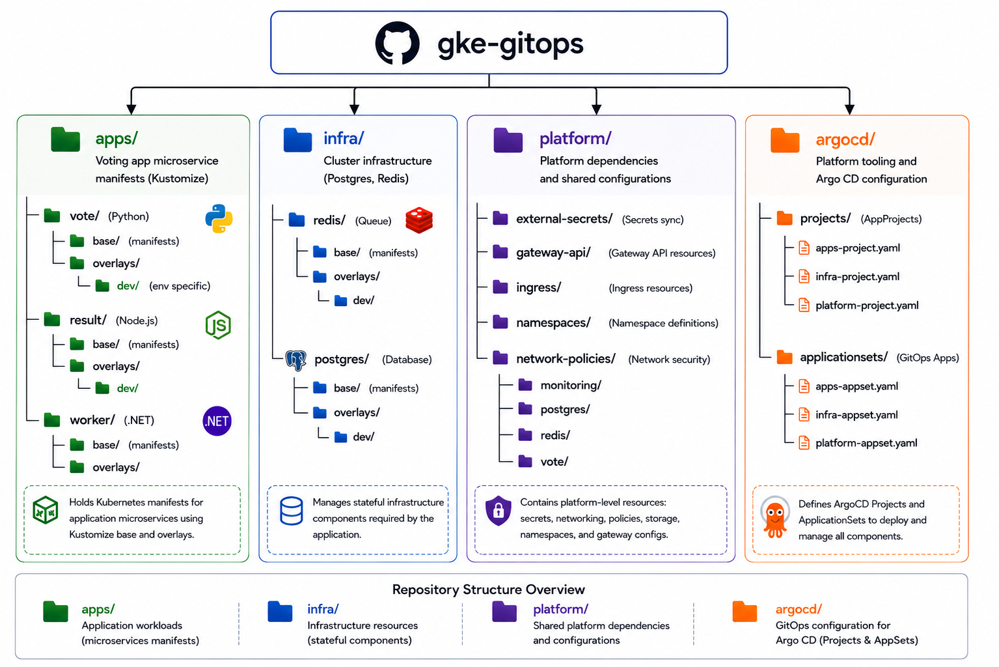

## GKE GitOps

Declarative Kubernetes configuration for a production-inspired Google Kubernetes Engine (GKE) environment using Argo CD, Kustomize, and GitOps principles.

---
## Overview

This repository serves as the **GitOps source of truth** for a **production-inspired Kubernetes environment** running on **Google Kubernetes Engine (GKE)**. It stores the declarative Kubernetes manifests that define the desired state of the cluster, including **application deployments**, **shared platform services**, **infrastructure components**, **security policies**, **governance controls**, **observability**, **networking**, **autoscaling**, **operational automation**, and **Argo CD** configuration.

Using **Argo CD** and **Kustomize**, all Kubernetes resources are version-controlled, automatically synchronized, and continuously reconciled with the cluster. This GitOps workflow enables automated deployments, self-healing, configuration drift detection, and consistent Kubernetes configuration management without manually applying manifests.

### Key Highlights

* GitOps-based continuous delivery using **Argo CD** and **Kustomize**
* Application deployment and environment management using **Kustomize** overlays
* CI automation using **GitHub Actions**
* Progressive delivery with **Argo Rollouts**
* Kubernetes policy enforcement with **Kyverno**
* Secrets management with **External Secrets** and **HashiCorp Vault**
* Kubernetes networking using the **Gateway API**
* Horizontal autoscaling with **HPA** and **KEDA**
* Observability with **Prometheus** and **Grafana**
* Cost visibility with **Kubecost**
* Runtime security monitoring with **Falco**
* Backup and disaster recovery with **Velero**
* Certificate management with **cert-manager**
* Declarative governance, security, and operational configuration managed through GitOps

This repository complements the **gke-infrastructure** repository, which provisions the underlying Google Cloud infrastructure using Terraform. Once the infrastructure is created, this repository manages Kubernetes applications, platform services, governance, security, and day-2 operational resources through a GitOps workflow.

<div align="center">


**This project is part of my portfolio and demonstrates production-inspired Kubernetes, GitOps, DevOps, and Platform Engineering practices on Google Kubernetes Engine (GKE).**

</div>

---
## Table of Contents

- [Overview](#overview)
  - [Key Highlights](#key-highlights)
- [Why This Project](#why-this-project)
- [Key Capabilities](#key-capabilities)
- [Technology Stack](#technology-stack)
- [Architecture](#architecture)
  - [Key Architectural Layers](#key-architectural-layers)
    - [Infrastructure Layer](#infrastructure-layer)
    - [CI Layer](#ci-layer)
    - [GitOps Layer](#gitops-layer)
    - [Kubernetes Platform Layer](#kubernetes-platform-layer)
- [Repository Structure](#repository-structure)
- [Demo](#demo)
  - [Blue-Green Deployment](#blue-green-deployment)
  - [Canary Deployment](#canary-deployment)
  - [Monitoring](#monitoring)
  - [Cost Visibility](#cost-visibility)
- [Documentation](#documentation)
- [Future Enhancements](#future-enhancements)
- [License](#license)

---
## Why This Project

Modern cloud-native applications require more than just deploying containers—they demand reliable infrastructure, automated delivery, security, observability, and scalable operations. This project was created to demonstrate how these capabilities can be integrated into a production-inspired Kubernetes platform using GitOps principles.

Rather than focusing only on the application itself, this repository showcases the end-to-end platform that provisions infrastructure, automates CI/CD, enforces security policies, manages secrets, enables progressive delivery, provides observability, and supports autoscaling on **Google Kubernetes Engine (GKE)**.

The goal is to provide a practical reference implementation for DevOps and Platform Engineering practices using modern CNCF and cloud-native technologies.

---
## Key Capabilities

| Capability                          | Implementation                                                                                                                |
| ----------------------------------- | ----------------------------------------------------------------------------------------------------------------------------- |
| **Infrastructure Provisioning**     | Provisions and manages Google Cloud infrastructure using Terraform.                                                           |
| **Container Orchestration**         | Runs containerized workloads on Google Kubernetes Engine (GKE).                                                               |
| **GitOps Continuous Delivery**      | Synchronizes Kubernetes manifests from Git repositories using Argo CD.                                                        |
| **Continuous Integration**          | Automates testing, image building, security scanning, signing, and publishing with GitHub Actions.                            |
| **Configuration Management**        | Manages Kubernetes manifests across environments using Kustomize.                                                             |
| **Progressive Delivery**            | Performs controlled canary deployments using Argo Rollouts.                                                                   |
| **Networking & Traffic Management** | Routes external traffic using the Kubernetes Gateway API.                                                                     |
| **Security & Secrets Management**   | Enforces Kubernetes policies with Kyverno and manages secrets through External Secrets integrated with Google Secret Manager and Hashicorp Vault. |
| **Observability**                   | Provides metrics, dashboards and alerting with Prometheus and Grafana.                           |
| **Autoscaling**                     | Supports resource-based and event-driven scaling using HPA and KEDA.                                                          |
| **Stateful Services**               | Deploys PostgreSQL and Redis as persistent data services for application workloads.                                           |

---
## Technology Stack

| Category                   | Technologies                                     |
| -------------------------- | ------------------------------------------------ |
| **Cloud Platform**         | Google Cloud Platform (GCP)                      |
| **Infrastructure as Code** | Terraform                                        |
| **Container Platform**     | Docker, Google Kubernetes Engine (GKE)           |
| **Continuous Integration** | GitHub Actions                                   |
| **GitOps**                 | Argo CD, Kustomize                               |
| **Container Registry**     | Google Artifact Registry                         |
| **Networking**             | Kubernetes Gateway API                           |
| **Progressive Delivery**   | Argo Rollouts                                    |
| **Security**               | Kyverno, External Secrets, Google Secret Manager |
| **Observability**          | Prometheus, Grafana, Loki                        |
| **Autoscaling**            | Horizontal Pod Autoscaler (HPA), KEDA            |
| **Data Services**          | PostgreSQL, Redis                                |
| **Languages & Frameworks** | Python (Flask), Node.js (Express), .NET          |
| **Version Control**        | Git, GitHub                                      |

---
## Architecture

<p align="left">
  
</p>

### Key Architectural Layers

The platform is organized into four logical layers, each responsible for a specific part of the application lifecycle.

#### Infrastructure Layer

The infrastructure layer provisions the Google Cloud environment using Terraform, including networking, IAM, Google Kubernetes Engine (GKE), and Artifact Registry.

#### CI Layer

The CI layer uses GitHub Actions to build, test, scan, sign, and publish container images. Successful builds update the GitOps repository with the new image versions.

#### GitOps Layer

The GitOps layer serves as the single source of truth for Kubernetes manifests. Argo CD continuously monitors the GitOps repository and reconciles the desired state with the Kubernetes cluster, enabling automated deployments and self-healing.

#### Kubernetes Platform Layer

The Kubernetes platform hosts the application workloads and platform services. The voting application runs alongside operational components such as Gateway API, Argo Rollouts, Kyverno, External Secrets, Prometheus, Grafana, Loki, HPA, and KEDA, providing networking, security, observability, progressive delivery, and autoscaling capabilities.

---
## Repository Structure

```
gke-gitops/
├── apps/
│   ├── vote/
│   ├── result/
│   └── worker/
│
├── infrastructure/
│   ├── postgres/
│   ├── redis/
│   ├── pgadmin/
│   └── external-secrets-sa/
│
├── platform/
│   ├── gateway-api/
│   ├── monitoring/
│   ├── clusterissuer/
│   ├── cluster-secrets/
│   ├── namespaces/
│   ├── ingress/
│   └── velero/
│
├── security/
│   ├── kyverno/
│   ├── falco/
│   └── network-policies/
│
├── governance/
├── automation/
├── argocd/
└── docs/
```

The repository is organized into logical directories, each responsible for a specific layer of the GitOps platform.

---
## Demo 

### Blue-Green Deployment


### Canary Deployment


### Monitoring


### Cost Visibility


---
## Documentation

| Document | Description |
| :------- | :---------- |
| **[Repository Structure](docs/platform-components/repository-structure.md)** | Complete repository layout, directory hierarchy, and Kubernetes manifest organization. |
| **[Applications](docs/platform-components/applications.md)** | Kubernetes manifests for application workloads managed with Kustomize overlays. |
| **[Infrastructure](docs/platform-components/infrastructure.md)** | Stateful services such as PostgreSQL, Redis, pgAdmin, and supporting infrastructure components. |
| **[Platform](docs/platform-components/platform.md)** | Shared platform services including networking, certificates, monitoring, namespaces, and backup resources. |
| **[Security](docs/platform-components/security.md)** | Kubernetes security policies, runtime security, and network segmentation. |
| **[Governance](docs/platform-components/governance.md)** | Namespace governance through ResourceQuota and LimitRange policies. |
| **[Automation](docs/platform-components/automation.md)** | Operational automation using Kubernetes CronJobs and supporting resources. |
| **[GitOps Configuration](docs/platform-components/gitops-configuration.md)** | Argo CD AppProjects and ApplicationSets for GitOps-based deployment and lifecycle management. |

> **Note:** Detailed documentation for each directory and its components is available in the **[`docs/`](docs/platform-components)** directory.

---
## Future Enhancements

The platform is continuously evolving. Planned enhancements include:

* Multi-environment support (Development, Staging, and Production)
* Automated end-to-end integration testing
* Multi-cluster GitOps deployments with Argo CD
* Disaster recovery validation using Velero restore testing
* Cost optimization and reporting with Kubecost
* Policy-as-Code validation within the CI pipeline
* Advanced observability with distributed tracing using OpenTelemetry
* Infrastructure compliance and security scanning in CI/CD
* Automated dependency and container image updates
* Support for additional cloud providers to enable a multi-cloud deployment model

These enhancements will further improve the platform's scalability, reliability, security, and operational maturity.

---
## License

This project is licensed under the **MIT License**. See the [LICENSE](LICENSE) file for details.
