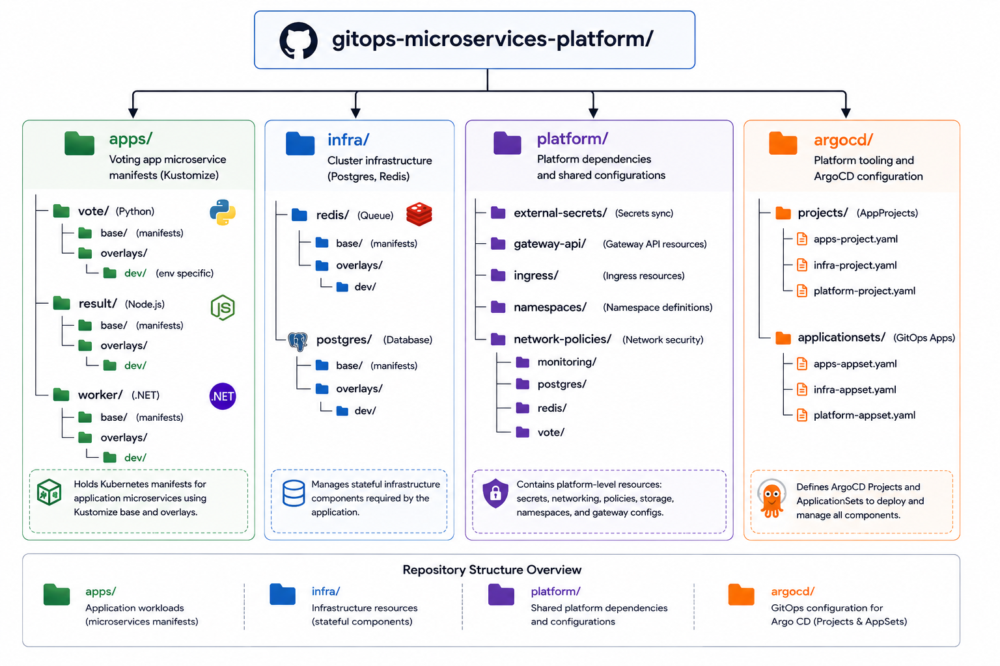

# gitops-microservices-platform

The **GitOps repository** for the [gitops-platform-engineering](https://github.com/stackcouture/gitops-platform-engineering) portfolio project. This repository is the **single source of truth** for the desired state of all Kubernetes workloads running on the GKE cluster — including application deployments, infrastructure add-ons, platform tooling, and ArgoCD configuration.

ArgoCD continuously watches this repository and automatically reconciles the live cluster state to match what is defined here. No manual `kubectl apply` is ever used for deployments.

---

## Table of Contents

- [Overview](#overview)
- [How It Fits Into the Platform](#how-it-fits-into-the-platform)
- [Architecture](#architecture)
- [Folder Structure](#folder-structure)
- [Folders In Detail](#folders-in-detail)
  - [apps/](#-apps)
  - [argocd/](#-argocd)
  - [infra/](#-infra)
  - [platform/](#-platform)
- [GitOps Workflow](#gitops-workflow)
- [App of Apps Pattern](#app-of-apps-pattern)
- [Kustomize Structure](#kustomize-structure)
- [Adding a New Application](#adding-a-new-application)
- [Bootstrapping ArgoCD](#bootstrapping-argocd)
- [Prerequisites](#prerequisites)
- [Contributing](#contributing)
- [Related Repositories](#related-repositories)

---

## Overview

This repo contains **no application source code**. It contains only Kubernetes manifests, Kustomize overlays, and ArgoCD configuration — the desired state of the cluster. It is updated automatically by the CI pipeline in `voting-app` whenever a new image is built and pushed.

| What lives here                                  | What does NOT live here       |
|--------------------------------------------------|-------------------------------|
| Kubernetes Deployments, Services, ConfigMaps     | Application source code       |
| Kustomize `base/` and `overlays/`                | Dockerfiles                   |
| ArgoCD `Application` and `AppProject` manifests  | CI pipeline definitions       |
| Infrastructure add-on configs (namespaces, RBAC) | Terraform infrastructure code |
| Platform tooling manifests                       | Secrets (managed via External Secrets or Sealed Secrets)  |

---
## How It Fits Into the Platform

This repo is the middle layer of a three-repo GitOps platform:

| Repo                                            | Role                                   |
|-------------------------------------------------|----------------------------------------|
| `platform-infra`                                | Terraform — provisions GKE, VPC, IAM,  Artifact Registry                      |
| `voting-app`                                    | Application source code + CI builds + image push                           |
| **`gitops-microservices-platform`** (this repo) | Desired Kubernetes state — watched by  ArgoCD                                 |

```
voting-app CI pushes new image tag
              │
              ▼
  gitops-microservices-platform
  (kustomize edit set image → git commit)
              │
              ▼
      ArgoCD detects the change
              │
              ▼
    GKE cluster synced ✓
```
---
## Architecture



---
## Folder Structure

```
gitops-microservices-platform/
├── README.md
│
├── apps/                               # Voting app microservice Kubernetes manifests
│   ├── vote/                           # Python voting frontend
│   │   ├── base/
│   │   │   ├── analysis-template.yaml
│   │   │   ├── hpa.yaml
|   |   |   ├── kustomization.yaml
│   │   │   ├── pdb.yaml
|   |   |   ├── postgres-alias.yaml
|   |   |   ├── rbac.yaml
│   │   │   ├── redis-alias.yaml
|   |   |   ├── rollout.yaml
|   |   |   ├── serviceaccount.yaml
│   │   │   ├── servicemonitor.yaml
|   |   |   ├── vote-alert-rules.yaml
│   │   │   ├── vote-canary-service.yaml
│   │   │   └── vote-stable-service.yaml
│   │   └── overlays/
│   │       └── dev/  
│   │           └── kustomization.yaml/ # Sets image tag, replica count, env patches
│   ├── result/                         # Node.js results frontend
│   │   ├── base/
│   │   │   ├── kustomization.yaml
│   │   │   ├── rbac.yaml
|   |   |   ├── result-active-svc.yaml
│   │   │   ├── result-preview-svc.yaml
|   |   |   ├── rollout.yaml
│   │   │   ├── serviceaccount.yaml
│   │   │   └── servicemonitor.yaml
│   │   └── overlays/
│   │       └── dev/
│   │           ├── kustomization.yaml  # Updated automatically by CI with new image SHA
│   ├── worker/                         # .NET vote processor
│   │   ├── base/
│   │   │   ├── deployment.yaml
│   │   │   └── kustomization.yaml
│   │   └── overlays/
│   │       └── dev/
│   │           └── kustomization.yaml
├── infra/   
│   ├── redis/                          # Redis in-memory queue
│   │   ├── base/
│   │   │   ├── service-headless.yaml
│   │   │   ├── service.yaml
|   |   |   ├── statefulset.yaml
│   │   │   └── kustomization.yaml
│   │   └── overlays/
│   │       └── dev/
│   │           └── kustomization.yaml
│   └── postgres/                             # PostgreSQL persistent store
│       ├── base/
│       │   ├── externalsecret.yaml
|       |   ├── service-headless.yaml
│       │   ├── service.yaml
│       │   ├── statefulset.yaml
│       │   └── kustomization.yaml
│       └── overlays/
│           └── dev/
│               └── kustomization.yaml
│
├── argocd/                             # ArgoCD bootstrap and Application definitions
│   ├── projects/
|   |   ├── apps-project.yaml           # AppProject — scopes apps to this repo and cluster
|   |   ├── infra-project.yaml   
│   │   └── platform-project.yaml     
│   ├── applicationsets/
│   │   ├── apps-appset.yaml               # ArgoCD Application for apps service
│   │   ├── infra-appset.yaml             # ArgoCD Application for infra service
│   │   └── platform-appset.yaml             # ArgoCD Application for platform service
│
└── platform/                               
│   ├── external-secrets/                           
│   │   ├── base/
│   │   │   ├── clustersecretstore.yaml
|   |   |   ├── kustomization.yaml
│   │   └── overlays/
│   │       └── dev/  
│   │           └── kustomization.yaml/ 
|   ├── gateway-api/                           
│   │   ├── base/
│   │   │   ├── gateway.yaml
|   |   |   ├── result-httproute.yaml
|   |   |   ├── kustomization.yaml
│   │   └── overlays/
│   │       └── dev/  
│   │           └── kustomization.yaml/ 
│   ├── ingress/                         
│   │   ├── base/
│   │   │   ├── kustomization.yaml
│   │   │   ├── argocd-ingress.yaml
|   |   |   ├── grafana-ingress.yaml
│   │   │   ├── prometheus-ingress.yaml
|   |   |   ├── result-ingress.yaml
│   │   │   └── vote-ingress.yaml
│   │   └── overlays/
│   │       └── dev/
│   │           └── kustomization.yaml/  
│   ├── namespaces/                         
│   │   ├── base/
│   │   │   ├── kustomization.yaml
│   │   │   ├── argo-rollouts.yaml
|   |   |   ├── argocd-namespace.yaml
│   │   │   ├── external-secrets-namespace.yaml
|   |   |   ├── ingress-nginx-namespace.yaml
|   |   |   ├── monitoring-namespace.yaml
|   |   |   ├── postgres-namespace.yaml
│   │   │   ├── redis-namespace.yaml
│   │   │   └── vote-namespace.yaml
│   │   └── overlays/
│   │       └── dev/
│   │           └── kustomization.yaml/
│   ├── network-policies/      
|   |   ├── monitoring/                   
│   │   |   ├── base/
|   |   |   |   ├── kustomization.yaml
│   │   |   │   ├── allow-prometheus-to-result.yaml
|   |   |   |   └── allow-prometheus-to-vote.yaml
|   |   |   └── overlays/
|   |   |        └── dev/
│   │                └── kustomization.yaml/
|   |   ├── postgres/                   
│   │   |   ├── base/
|   |   |   |   ├── kustomization.yaml
│   │   |   │   ├── allow-result-to-db.yaml
|   |   |   |   ├── allow-vote-namespace.yaml
|   |   |   |   └── default-deny.yaml
|   |   |   └── overlays/
|   |   |        └── dev/
│   │                └── kustomization.yaml/
|   |   ├── redis/                   
│   │   |   ├── base/
|   |   |   |   ├── kustomization.yaml
│   │   |   │   ├── allow-dns.yaml
|   |   |   |   ├── allow-vote-namespace.yaml
|   |   |   |   └── default-deny.yaml
|   |   |   └── overlays/
|   |   |        └── dev/
│   │                └── kustomization.yaml/
|   |   ├── vote/                   
│   │   |   ├── base/
|   |   |   |   ├── kustomization.yaml
│   │   |   │   ├── allow-dns.yaml
|   |   |   |   ├── allow-external-to-result.yaml
|   |   |   |   ├── allow-external-to-vote.yaml
│   │   |   │   ├── allow-gateway-result.yaml
|   |   |   |   ├── allow-ingress-nginx-to-result.yaml
|   |   |   |   ├── allow-ingress-nginx-to-vote.yaml
│   │   |   │   ├── allow-result-to-postgres.yaml
|   |   |   |   ├── allow-vote-to-redis.yaml
|   |   |   |   ├── allow-worker-to-postgres.yaml
│   │   |   │   ├── allow-worker-to-redis.yaml
|   |   |   |   └── default-deny.yaml
|   |   |   └── overlays/
|   |   |        └── dev/
│   │                └── kustomization.yaml/
    ├── storage/                         
        ├── base/
        │   ├── premium-two.yaml
        │   └── kustomization.yaml
        └── overlays/
            └── dev/
                └── kustomization.yaml
```
---
## Folders In Detail

### 📁 `apps/`

Contains all Kubernetes manifests for the five voting app microservices. Each service follows the same **Kustomize `base` + `overlays`** pattern:

- **`base/`** — environment-agnostic Kubernetes resources (`Deployment`, `Service`, `ConfigMap`). Uses a placeholder image tag and is never edited directly after initial creation.
- **`overlays/dev/`** — dev-environment-specific patches: image tag (updated by CI on every build), replica count, resource limits, and environment variables.

**Services managed:**

| Service    | Language       | Port | Description                          |
|------------|----------------|------|--------------------------------------|
| `vote`     | Python (Flask) | 80   | Web UI for casting votes             |
| `result`   | Node.js        | 80   | Web UI for displaying results        |
| `worker`   | C# (.NET)      | —    | Processes votes: Redis to PostgreSQL |

**How image tags are updated by CI:**

When the `voting-app` CI pipeline pushes a new image to Artifact Registry, it automatically runs:

```bash
cd apps/result/overlays/dev
kustomize edit set image \
  result=asia-south1-docker.pkg.dev/<project>/vote-docker-repo/result:<new-sha>
```

commits, and pushes to `main`. ArgoCD detects the change within minutes and rolls out the new pod.

---
### 📁 `argocd/`

Contains all ArgoCD configuration — the **App of Apps bootstrap** 

```yaml
apiVersion: argoproj.io/v1alpha1
kind: ApplicationSet
metadata:
  name: apps-applications
  namespace: argocd
spec:
  generators:
    - list:
        elements:
          - name: vote
            namespace: vote
            path: apps/vote/overlays/dev
          - name: result
            namespace: vote
            path: apps/result/overlays/dev
          - name: worker
            namespace: vote
            path: apps/worker
  template:
    metadata:
      name: '{{name}}-app'
    spec:
      project: apps-project
      source:
        repoURL: https://github.com/stackcouture/gitops-microservices-platform.git
        targetRevision: main
        path: '{{path}}'
      destination:
        server: https://kubernetes.default.svc
        namespace: '{{namespace}}'
      syncPolicy:
        automated:
          prune: true
          selfHeal: true
        syncOptions:
          - CreateNamespace=true
```

**`argocd/projects/voting-app-project.yaml`** — an `AppProject` that scopes all voting app `Applications` to:
- This Git repository as the only allowed source
- The `voting-app` namespace as the only allowed destination
- A restricted set of allowed Kubernetes resource kinds (least privilege)

**`argocd/applicationsets/*.yaml`** — one `Application` manifest per microservice. Each `ApplicationSet`:
- Points to a specific `apps/<service>/overlays/dev/` path in this repo
- Uses `syncPolicy.automated` for hands-free sync on every Git change
- Enables `selfHeal: true` to automatically revert any manual cluster changes back to Git state

---